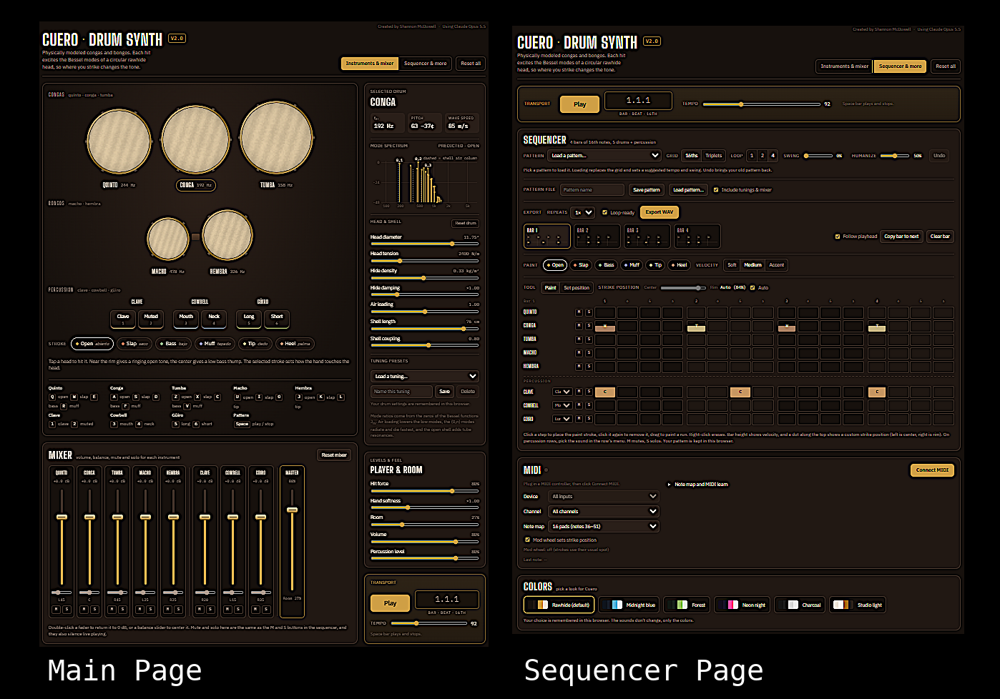

# Cuero · Drum Synth · V2.0

**A physically modeled conga and bongo synthesizer that runs in your browser.** There are no samples and nothing to install. Every hit is calculated from the physics of a round rawhide drumhead, so *where* you strike it changes the tone, just like a real hand drum.

*Cuero* is Spanish for "hide" or "leather", which is what congueros call the drumhead.

Created by Shannon McDowell · Using Claude Opus 5.5

---

## Highlights

- **Five physically modeled drums.** Three congas (quinto, conga, tumba) and two bongos (macho, hembra), each with its own size, tuning and body.
- **Clave, cowbell and güiro.** A percussion section with two sounds per instrument, a wood or metal clave, and editable sound for each.
- **Strike anywhere on the head.** Near the rim gives a ringing open tone and the center gives a deep bass thump, with everything in between.
- **Six hand strokes.** Open, slap, bass, muff, tip and heel, each modeling a different way the hand meets the skin.
- **Live physics controls.** Change head size, tension, hide weight, damping, air loading, shell length and shell coupling, and see the pitch update as you go.
- **Mixer.** Volume, left–right balance, mute and solo for every instrument, with names that light up as each one plays.
- **MIDI.** Play every drum, stroke and percussion sound from pads or a keyboard, with MIDI learn.
- **4-bar step sequencer.** 16th-note or triplet (6/8, 12/8) grid, with stroke, velocity and strike position on every step, and 26 built-in patterns.
- **Save your work.** Pattern files, tuning presets, and settings that are remembered between sessions.
- **WAV export.** Render your loop to a stereo WAV file, including a loop-ready option for seamless looping in a DAW.
- **Six color themes** and a **two-page layout** that fits a laptop screen.
- **One self-contained HTML file.** No build step, no dependencies, no server. Open it and play.

---

## Quick start

1. Download `cuero-drum-synth-V2.html`.
2. Open it in a modern web browser (Chrome, Edge, Firefox or Safari).
3. Click any drumhead to hear it. Browsers only allow sound after your first click.
4. Press **Space** or click **Play** in the Transport to start the sequencer.
5. Use the buttons in the header to switch between the **Instruments & mixer** page and the **Sequencer & more** page.

---

## How the sound is made

Cuero uses **modal synthesis**. Instead of playing back recordings, it models how each instrument vibrates and adds those vibrations together.

**The drumhead.** A round drumhead vibrates in a set of patterns called *modes*, labeled (m, n). *m* is the number of lines across the head that stay still, and *n* is the number of rings that stay still. Their frequencies come from the zeros of Bessel functions, the math that describes vibrations of a circle. Cuero models **28 modes per drum** (m = 0–6, n = 1–4).

**Strike position.** How strongly each mode rings depends on where you hit. Every mode has a different shape across the head, so the center excites mostly the low, "breathing" modes and the rim brings in the brighter ones. Even which side of the head you strike changes the tone slightly.

**The hand.** Each stroke has its own:
- **Contact time.** A quick slap (about 0.5 ms) excites high frequencies; a soft palm (about 5 ms) filters them out.
- **Contact width.** A broad palm can't excite small, tight modes; a fingertip can.
- **Damping.** On muffs and slaps the hand stays on the head and deadens it. Slaps also add a short "crack" transient.

**Real-drum details:**
- **Pitch glide.** A hard hit stretches the head for an instant, so the pitch drops slightly as the note rings out.
- **Air loading.** The air around the head lowers the frequencies of the low modes.
- **Radiation damping.** The modes that push the most air (the m = 0 family) radiate their energy fastest, so they die away first.
- **Shell resonance.** The open drum body acts like a tube and adds its own low resonances, driven by how much air the head moves.
- **Uneven hide.** Paired modes are detuned slightly, as on a real skin, which gives a natural shimmer.

**The percussion:**
- **Clave:** a wooden clave rings with one dominant bending mode, a small overtone and a wood "knock". The metal clave is modeled as a metal bar, with brighter overtones and a much longer ring.
- **Cowbell:** a set of uneven, plate-like metal modes. Striking the mouth brings out the low ring, and striking the neck brings out the higher, choked modes.
- **Güiro:** a fast train of ticks as the stick crosses the ridges, filtered through the resonances of the gourd.

Each instrument then passes through its own **mixer channel** (volume and balance), a small room reverb and a gentle compressor.

---

## The interface

Cuero has two pages, switched from the header. The **Transport** (Play, tempo and bar position) appears on both, so playback continues as you move between them.

### Page 1: Instruments & mixer

#### Drums
Each drum is drawn to scale from its head diameter. When you hit a head, it ripples in slow motion, and the ripples are drawn from the same mode calculation that makes the sound. Each drum's label shows its fundamental frequency.

| Drum | Head | Default pitch |
|---|---|---|
| Quinto | 11″ | ~244 Hz |
| Conga | 11.75″ | ~192 Hz |
| Tumba | 12.5″ | ~158 Hz |
| Macho (bongo) | 7″ | ~478 Hz |
| Hembra (bongo) | 8.5″ | ~326 Hz |

#### Strokes
| Stroke | Spanish | Character |
|---|---|---|
| Open | *abierto* | Ringing, singing tone near the rim |
| Slap | *seco* | Sharp, cracking accent with the fingers left on the head |
| Bass | *bajo* | Deep palm hit in the center |
| Muff | *tapado* | Closed, muted tone |
| Tip | *dedo* | Light fingertip touch |
| Heel | *palma* | Soft heel-of-the-hand press |

#### Percussion
| Instrument | Sounds | Sound controls |
|---|---|---|
| Clave | Clave, Muted | **Wood or Metal**, pitch, ring time, brightness, body knock |
| Cowbell | Mouth, Neck | Pitch, ring time, metal brightness, stick clank, shimmer |
| Güiro | Long, Short | Gourd size, scrape speed, long-scrape length, brightness |

Tap a pad to play it. Click an instrument's name, or tap one of its pads, to show its sound controls in the side panel.

#### Selected Drum / Selected Instrument panel
Select any drum to see its fundamental frequency, the nearest musical note (with cents), and the wave speed across the head. A **mode spectrum** chart shows every mode excited by the last hit, labeled (m, n), with the shell's air-column resonances drawn as dashed lines. For percussion, the panel shows pitch, note and ring time, and a spectrum measured from the actual sound.

**Head & shell controls** (per drum):
- Head diameter (6–13.5″)
- Head tension (800–7000 N/m)
- Hide density (0.12–0.55 kg/m²)
- Hide damping
- Air loading
- Shell length (12–85 cm)
- Shell coupling

**Tuning presets:** Factory, Fourths (D–G–C), Root, fifth, octave in C, and A minor, plus any tunings you save yourself.

**Reset drum** / **Reset instrument** restores the selected instrument's settings. **Reset all** in the header restores every instrument, the player and room settings, the mixer's levels and balance, and the tempo.

#### Mixer
- A channel for each of the eight instruments, with a **volume fader** (in dB), **left–right balance**, and **M**ute and **S**olo buttons
- A **Master** fader, linked to the Volume control
- Drag a fader, use the arrow keys, or double-click to reset it
- Pressed mute buttons glow red and pressed solo buttons glow yellow
- Each instrument's name lights up when it sounds
- Mute and solo are shared with the sequencer, and also silence live playing

#### Player & Room
Hit force, hand softness, room reverb, volume and percussion level.

### Page 2: Sequencer & more
The Transport, Sequencer, MIDI and Colors sections. See below.

### Keyboard
| Instrument | Keys |
|---|---|
| Quinto | Q open · W slap · E bass · R muff |
| Conga | A open · S slap · D bass · F muff |
| Tumba | Z open · X slap · C bass · V muff |
| Macho | U open · I slap · O tip |
| Hembra | J open · K slap · L tip |
| Clave | 1 clave · 2 muted |
| Cowbell | 3 mouth · 4 neck |
| Güiro | 5 long · 6 short |
| Sequencer | Space play / stop · Ctrl/Cmd + Z undo |

---

## Sequencer

- **4 bars**, with one row for each of the five drums and three percussion instruments.
- **Two grids:** **16ths** for 4/4, or **Triplets** (12 steps per bar) for 6/8 and 12/8 rhythms. Switching moves your hits to the nearest step.
- **Every step stores its own stroke and velocity.** Colors identify the stroke and bar height shows velocity.
- **Paint with the mouse.** Click to place, click again to remove, drag to paint a run. Right-click erases. On touch screens, tap.
- **Velocity brushes:** Soft, Medium, Accent.
- **Percussion rows** have a menu for choosing which sound you paint.
- **Per-step strike position:** set a position from center to rim before painting, or use the **Set position** tool to change hits already in the grid. A dot on each step shows where the hand lands.
- **Mute (M) and Solo (S)** on each row.
- **Bar tabs** with mini previews of each bar, plus **Copy bar to next** and **Clear bar**.
- **Loop length:** 1, 2 or 4 bars.
- **Swing** delays every other 16th note.
- **Humanize** adds small random changes in timing, velocity and strike position, so repeats never sound machine-identical.
- **Follow playhead** shows each bar as it plays.
- **Undo** reverses edits, pattern loads, clears and grid changes.
- **Pattern files:** name a pattern, click **Save pattern**, and open it again with **Load pattern…**. With **Include tunings & mixer** checked, the file also carries your sound and mixer settings.
- Your pattern, tempo and settings are **saved in your browser** automatically.

### Built-in patterns
Each pattern loads with a suggested tempo and swing.

**Salsa & son**

| Pattern | Tempo | Description |
|---|---|---|
| Salsa | 98 | Tumbao on conga and tumba, martillo on bongos, and a quinto answer in bar 4 |
| Tumbao | 98 | The core salsa conga groove |
| Martillo | 98 | The classic bongo "hammer" pattern |
| Cha-cha-chá | 116 | A straighter cousin of tumbao, with open tones answered on the tumba |
| Bolero | 74 | Slow ballad feel with soft conga and a bongo roll into the top |

**Rumba & modern**

| Pattern | Tempo | Description |
|---|---|---|
| Rumba (simplified guaguancó) | 104 | Conga and tumba trade phrases while the quinto improvises |
| Songo feel (simplified) | 110 | Slap backbeat with syncopated open tones |
| Latin funk | 96 | Busy 16th-note congas, bongo ghost notes, hembra backbeat |

**With percussion**

| Pattern | Tempo | Description |
|---|---|---|
| Salsa with clave & bell (2-3) | 98 | Tumbao under a 2-3 son clave, with the bongo player on cowbell |
| Guaguancó with rumba clave (simplified) | 104 | The Rumba pattern locked to a 3-2 rumba clave |
| Cha-cha-chá with güiro & bell | 116 | Long-short-short güiro and a quarter-note cowbell |
| Clave study | 92 | Son clave, then rumba clave, over a quiet conga pulse |

**More grooves**

| Pattern | Tempo | Description |
|---|---|---|
| Son montuno with güiro & clave (simplified) | 94 | Tumbao and martillo over a 2-3 son clave |
| Mambo with bell (simplified) | 110 | A driving bongo bell, clave and quinto fills |
| Boogaloo (simplified) | 104 | 1960s Latin soul with backbeat slaps and a steady cowbell |
| Merengue-style güiro groove (simplified) | 128 | A long-short-short scrape on every beat |
| Latin house (simplified) | 124 | Conga ostinato, offbeat cowbell and a rumba clave |

**6/8 & triplets**

| Pattern | Tempo | Description |
|---|---|---|
| Bembé feel (simplified) | 104 | The standard 6/8 bell pattern over a triplet conga groove |
| 12/8 rumba feel (simplified) | 100 | A triplet rumba groove over the 6/8 clave |
| 6/8 groove with clave (simplified) | 84 | A relaxed conga and bongo groove over the 6/8 clave |
| Empty (triplet grid) | — | A blank triplet grid |

**Showcase**

| Pattern | Tempo | Description |
|---|---|---|
| Quinto solo over tumbao | 100 | A quinto solo that builds from sparse calls to a dense run |
| Strike-position sweep | 90 | An open tone moving step by step from center to rim |
| Empty | — | A blank grid |

Patterns marked "simplified" are original versions of each style's feel, not transcriptions of traditional parts. Use them as starting points.

---

## WAV export

- **Stereo, 44.1 kHz, 16-bit** WAV, rendered offline with the same signal chain you hear live (mixer levels and balance, room and compressor).
- Respects swing, humanize, mute/solo, strike positions and all sound settings.
- **Repeats:** export the loop 1×, 2× or 4×.
- **Loop-ready** (on by default): the ring-out and reverb tail from the end of the loop are wrapped back onto the start. The file is then exactly N bars long and loops seamlessly in any DAW or sampler.
- Files are named automatically, for example `cuero-loop-98bpm-4bars.wav`, with `-6-8` added for triplet-grid loops.

> When Cuero runs inside Claude as an artifact, the WAV is delivered inside a `.zip` file, because that viewer doesn't allow `.wav` downloads directly. The standalone HTML file saves the `.wav` directly.

---

## MIDI

- Click **Connect MIDI**, then choose a device and channel (or leave both on "All").
- **Note maps:**
  - **16 pads (notes 36–51):** the most useful sounds, laid out for common 16-pad controllers
  - **Every sound (notes 36–71):** all 36 instrument-and-stroke combinations
  - **General MIDI percussion:** standard drum-kit notes for congas, bongos, clave, cowbell and güiro
- **MIDI learn:** open "Note map and MIDI learn", click **Learn** next to a sound, then hit the pad you want for it.
- Pad velocity sets loudness, and the **mod wheel** can set strike position (center to rim).
- An activity light and a "last note" display show what's coming in.
- Your map and settings are remembered.

> Live MIDI works in the standalone file in **Chrome, Edge and Firefox**. It isn't available inside Claude, or in Safari, which doesn't support Web MIDI.

---

## Colors

Six themes, remembered in your browser: **Rawhide** (default), **Midnight blue**, **Forest**, **Neon night**, **Charcoal** and **Studio light**. Only the colors change, never the sounds.

---

## Technical notes

- **Single file:** HTML, CSS and vanilla JavaScript, with no frameworks or build tools.
- **Audio:** Web Audio API. Each hit is synthesized into an audio buffer when it's played, then routed through a per-instrument mixer channel. Export uses `OfflineAudioContext`.
- **MIDI:** Web MIDI API (input only).
- **Graphics:** HTML canvas for the drumheads and the spectrum charts.
- **Storage:** `localStorage` for the pattern, sound settings, tuning presets, mixer, MIDI setup, color theme and current page, kept per browser only.
- **Files:** patterns are saved as readable JSON (`.json`).
- **Fonts:** Big Shoulders Display, IBM Plex Sans and IBM Plex Mono, loaded from Google Fonts. Offline, the app still works with system fonts.
- **Layout:** responsive. On narrow screens the sequencer grid and mixer scroll sideways.
- **Compatibility:** patterns saved in version 1.0 load automatically.

## Known limitations

- MIDI is input only. There's no MIDI output or `.mid` file export yet.
- Patterns are limited to 4 bars.
- Patterns marked "simplified" are starting points, not traditional transcriptions.
- Tested in Chromium-based browsers. Other modern browsers with Web Audio support should work, but haven't been fully tested.

## Ideas for future versions

- `.mid` file export
- Longer patterns and song mode
- One-click stem export (each instrument as its own WAV)
- More instruments, such as shekere, timbales or cajón
- Puerto Rican bomba and more Afro-Cuban patterns

---

## Credits

Created by **Shannon McDowell** · Using **Claude Opus 5.5**
