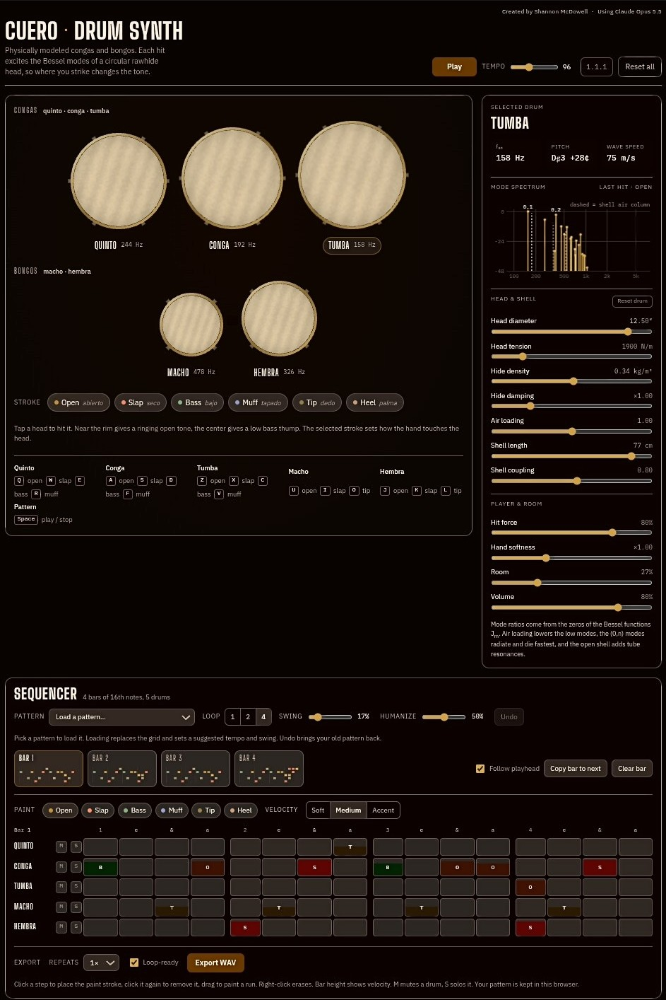

# Cuero · Drum Synth

**A physically modeled conga and bongo synthesizer that runs in your browser.** There are no samples and nothing to install. Every hit is calculated from the physics of a round rawhide drumhead, so *where* you strike it changes the tone, just like a real hand drum.

*Cuero* is Spanish for "hide" or "leather", which is what congueros call the drumhead.

Created by Shannon McDowell · Using Claude Opus 5.5

---

## Highlights

- **Five physically modeled drums.** Three congas (quinto, conga, tumba) and two bongos (macho, hembra), each with its own size, tuning and body.
- **Strike anywhere on the head.** Near the rim gives a ringing open tone and the center gives a deep bass thump, with everything in between.
- **Six hand strokes.** Open, slap, bass, muff, tip and heel, each modeling a different way the hand meets the skin.
- **Live physics controls.** Change head size, tension, hide weight, damping, air loading, shell length and shell coupling, and see the pitch update as you go.
- **4-bar step sequencer.** 16th-note grid with a stroke and velocity on every step, plus swing, humanize, mute/solo, undo and ten built-in patterns.
- **WAV export.** Render your loop to a stereo WAV file, including a loop-ready option for seamless looping in a DAW.
- **One self-contained HTML file.** No build step, no dependencies, no server. Open it and play.

---

## Quick start

1. Download `cuero-drum-synth.html`.
2. Open it in a modern web browser (Chrome, Edge, Firefox or Safari).
3. Click any drumhead to hear it. Browsers only allow sound after your first click.
4. Press **Space** or click **Play** to start the sequencer.

---

## How the sound is made

Cuero uses **modal synthesis**. Instead of playing back recordings, it models how a round, stretched membrane vibrates and adds those vibrations together.

**The drumhead.** A round drumhead vibrates in a set of patterns called *modes*, labeled (m, n). *m* is the number of lines across the head that stay still, and *n* is the number of rings that stay still. Their frequencies come from the zeros of Bessel functions, the math that describes vibrations of a circle. Cuero models **28 modes per drum** (m = 0–6, n = 1–4).

**Strike position.** How strongly each mode rings depends on where you hit. Every mode has a different shape across the head, so the center excites mostly the low, "breathing" modes and the rim brings in the brighter ones. Even which side of the head you strike changes the tone slightly.

**The hand.** Each stroke has its own:
- **Contact time.** A quick slap (about 0.5 ms) excites high frequencies; a soft palm (about 5 ms) filters them out.
- **Contact width.** A broad palm can't excite small, tight modes; a fingertip can.
- **Damping.** On muffs and slaps the hand stays on the head and deadens it. Slaps also add a short "crack" transient.

**Real-drum details:**
- **Pitch glide.** A hard hit stretches the head for an instant, so the pitch drops slightly as the note rings out.
- **Air loading.** The air around the head lowers the frequencies of the low modes.
- **Radiation damping.** The modes that push the most air (the m = 0 family) radiate their energy fastest, so they die away first.
- **Shell resonance.** The open drum body acts like a tube and adds its own low resonances, driven by how much air the head moves.
- **Uneven hide.** Paired modes are detuned slightly, as on a real skin, which gives a natural shimmer.

The sound then passes through a stereo mix (the drums are panned across the stage), a small room reverb and a gentle compressor.

---

## The interface

### Drums
Each drum is drawn to scale from its head diameter. When you hit a head, it ripples in slow motion, and the ripples are drawn from the same mode calculation that makes the sound. Each drum's label shows its fundamental frequency.

| Drum | Head | Default pitch |
|---|---|---|
| Quinto | 11″ | ~244 Hz |
| Conga | 11.75″ | ~192 Hz |
| Tumba | 12.5″ | ~158 Hz |
| Macho (bongo) | 7″ | ~478 Hz |
| Hembra (bongo) | 8.5″ | ~326 Hz |

### Strokes
| Stroke | Spanish | Character |
|---|---|---|
| Open | *abierto* | Ringing, singing tone near the rim |
| Slap | *seco* | Sharp, cracking accent with the fingers left on the head |
| Bass | *bajo* | Deep palm hit in the center |
| Muff | *tapado* | Closed, muted tone |
| Tip | *dedo* | Light fingertip touch |
| Heel | *palma* | Soft heel-of-the-hand press |

### Physics panel
Select any drum to see its fundamental frequency, the nearest musical note (with cents), and the wave speed across the head. A **mode spectrum** chart shows every mode excited by the last hit, labeled (m, n), with the shell's air-column resonances drawn as dashed lines.

**Head & shell controls** (per drum):
- Head diameter (6–13.5″)
- Head tension (800–7000 N/m)
- Hide density (0.12–0.55 kg/m²)
- Hide damping
- Air loading
- Shell length (12–85 cm)
- Shell coupling

**Player & room controls:** hit force, hand softness, room reverb, volume.

**Reset drum** restores the selected drum's settings, and **Reset all** restores every drum plus the tempo.

### Keyboard
| Drum | Keys |
|---|---|
| Quinto | Q open · W slap · E bass · R muff |
| Conga | A open · S slap · D bass · F muff |
| Tumba | Z open · X slap · C bass · V muff |
| Macho | U open · I slap · O tip |
| Hembra | J open · K slap · L tip |
| Sequencer | Space play / stop · Ctrl/Cmd + Z undo |

---

## Sequencer

- **4 bars of 16th notes**, with one row per drum.
- **Every step stores its own stroke and velocity.** Colors identify the stroke and bar height shows velocity.
- **Paint with the mouse.** Click to place, click again to remove, drag to paint a run. Right-click erases. On touch screens, tap.
- **Velocity brushes:** Soft, Medium, Accent.
- **Mute (M) and Solo (S)** on each drum.
- **Bar tabs** with mini previews of each bar, plus **Copy bar to next** and **Clear bar**.
- **Loop length:** 1, 2 or 4 bars.
- **Swing** delays every other 16th note.
- **Humanize** adds small random changes in timing, velocity and strike position, so repeats never sound machine-identical.
- **Follow playhead** shows each bar as it plays.
- **Undo** reverses edits, pattern loads and clears.
- Your pattern, tempo and settings are **saved in your browser** automatically.

### Built-in patterns
Each pattern loads with a suggested tempo and swing.

| Pattern | Tempo | Description |
|---|---|---|
| Salsa | 98 | Tumbao on conga and tumba, martillo on bongos, and a quinto answer in bar 4 |
| Tumbao | 98 | The core salsa conga groove |
| Martillo | 98 | The classic bongo "hammer" pattern |
| Cha-cha-chá | 116 | A straighter cousin of tumbao, with open tones answered on the tumba |
| Bolero | 74 | Slow ballad feel with soft conga and a bongo roll into the top |
| Rumba (simplified guaguancó) | 104 | Conga and tumba trade phrases while the quinto improvises |
| Songo feel (simplified) | 110 | Slap backbeat with syncopated open tones |
| Latin funk | 96 | Busy 16th-note congas, bongo ghost notes, hembra backbeat |
| Quinto solo over tumbao | 100 | A quinto solo that builds from sparse calls to a dense run |
| Empty | — | A blank grid |

---

## WAV export

- **Stereo, 44.1 kHz, 16-bit** WAV, rendered offline with the same signal chain you hear live (panning, room and compressor).
- Respects swing, humanize, mute/solo and all physics settings.
- **Repeats:** export the loop 1×, 2× or 4×.
- **Loop-ready** (on by default): the ring-out and reverb tail from the end of the loop are wrapped back onto the start. The file is then exactly N bars long and loops seamlessly in any DAW or sampler.
- Files are named automatically, for example `cuero-loop-98bpm-4bars.wav`.

> When Cuero runs inside Claude as an artifact, the WAV is delivered inside a `.zip` file, because that viewer doesn't allow `.wav` downloads directly. The standalone HTML file saves the `.wav` directly.

---

## Technical notes

- **Single file:** HTML, CSS and vanilla JavaScript, with no frameworks or build tools.
- **Audio:** Web Audio API. Each hit is synthesized into an audio buffer when it's played. Export uses `OfflineAudioContext`.
- **Graphics:** HTML canvas for the drumheads and the spectrum chart.
- **Storage:** `localStorage` for the sequencer pattern and settings, kept per browser only.
- **Fonts:** Big Shoulders Display, IBM Plex Sans and IBM Plex Mono, loaded from Google Fonts. Offline, the app still works with system fonts.
- **Layout:** responsive. On narrow screens the sequencer grid scrolls sideways.

## Known limitations

- The grid is 4/4 in 16th notes only, so 6/8 and 12/8 feels such as bembé aren't supported yet.
- There's no clave, cowbell or other percussion. The Rumba and Songo patterns are simplified versions meant as starting points.
- There's no MIDI input or output yet.
- Tested in Chromium-based browsers. Other modern browsers with Web Audio support should work, but haven't been fully tested.

## Ideas for future versions

- A clave, cowbell and güiro track
- A 6/8 grid for Afro-Cuban and Puerto Rican bomba rhythms
- MIDI input for pads and keyboards
- Save and load patterns as files
- Per-step strike-position control

---

## Credits

Created by **Shannon McDowell** · Using **Claude Opus 5.5**
